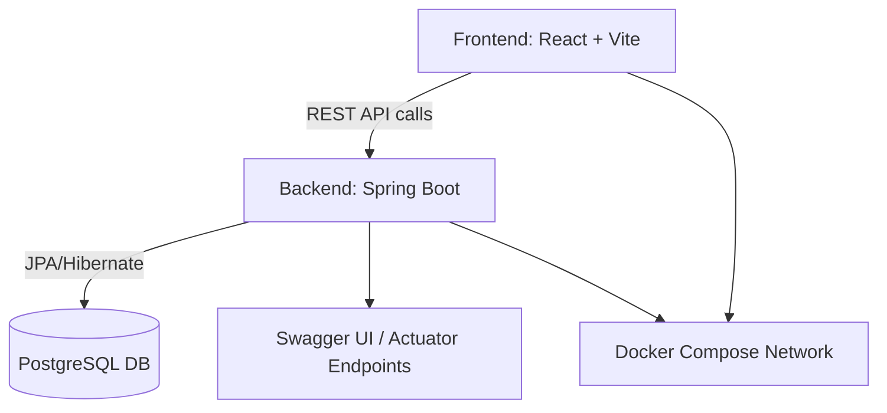

# 🧱 Spring React Vite Template

[](https://github.com/your-username/spring-react-vite-template/actions/workflows/test.yml)
[](./LICENSE)
[](#) <!-- Placeholder until Codecov is added -->


A modern **full-stack starter template** combining **Spring Boot + React + Vite + Docker + CI/CD**.  
Built for rapid prototyping and real-world deployment, with batteries included:  
✅ type-safe frontend, ✅ production-ready backend, ✅ local + Docker setup, ✅ GitHub Actions CI.

---

## 🚀 Overview

This template provides a minimal yet complete foundation for modern full-stack apps.  
It’s designed for **developer experience, testability, and maintainability**.

| Layer | Tech Stack | Highlights |
|-------|-------------|------------|
| **Frontend** | React (Vite, TypeScript, TailwindCSS, shadcn/ui) | Hooks-based, fast reload, typed API calls |
| **Backend** | Spring Boot 3 (Java 21, JPA, Actuator, OpenAPI) | RESTful, structured logging, validation |
| **Database** | PostgreSQL (Docker Compose) | Works with local + CI environments |
| **CI/CD** | GitHub Actions | Build, test, and coverage reporting |
| **Docs** | Swagger / OpenAPI | Auto-generated REST documentation |

---

## 📸 Screenshot or Demo (optional)

You can include a screenshot, animated GIF, or live demo link here.

Example:


> 💡 Tip: Store demo images in `/frontend/public` so Vite serves them easily.
> You can also embed a Loom or YouTube video if you have one.

---

## 🧭 Architecture



---

## ✨ Features

### 🖥️ Frontend
- ⚡ **Vite + TypeScript** — lightning-fast dev server with full type safety  
- 🎨 **TailwindCSS + shadcn/ui** — modern, composable UI with accessible components  
- 🧩 **React Query** — automatic caching and background data fetching  
- 🧠 **React Hook Form + Zod** — performant, schema-validated forms  
- 🔔 **Toaster + ErrorBoundary** — built-in global notifications and graceful error handling  
- 🧪 **Vitest + React Testing Library** — fast unit tests with JSDOM  

### ⚙️ Backend
- 🚀 **Spring Boot 3 + Java 21** — modern backend foundation with starter dependencies  
- 🗄️ **Spring Data JPA** — simplifies database access with minimal boilerplate  
- 📄 **Springdoc OpenAPI** — auto-generated Swagger API docs at `/swagger-ui.html`  
- 🩺 **Spring Boot Actuator** — built-in health, metrics, and readiness endpoints  
- 🧱 **Layered architecture** — Controllers → Services → Repositories → Entities → DTOs  
- 🧰 **JUnit + Mockito** — unit & integration tests ready to extend  
- 🧾 **Structured JSON logging** — production-ready logging via Logback + Logstash  

### 🐳 DevOps & Tooling
- 🧩 **Docker Compose** — runs backend + PostgreSQL seamlessly  
- 🧱 **Multi-stage Dockerfile** — optimized build for backend JAR  
- ⚙️ **GitHub Actions CI** — build, test, coverage report per PR  
- 🔄 **Dependabot** — weekly dependency updates grouped by type  
- 🪶 **Husky + lint-staged** — auto-format and lint pre-commit  
- 🧪 **JaCoCo Coverage Report** — backend coverage shown in PR summary  
- 🧭 **EditorConfig + VSCode Extensions** — consistent formatting across environments  

---

## 🧪 Local Development

### 🛠 Prerequisites
Make sure you have the following installed:
- [Node.js 22+](https://nodejs.org/)
- [Java 21 (Temurin recommended)](https://adoptium.net/)
- [Docker & Docker Compose](https://www.docker.com/)
- [Git](https://git-scm.com/)

---

## 🧱 Backend (Spring Boot)

```bash  
cd backend  
./gradlew bootRun  
```

Access:  
- API: <http://localhost:8080>  
- Swagger Docs: <http://localhost:8080/swagger-ui.html>  
- Health Check: <http://localhost:8080/actuator/health>  

---

## 💻 Frontend (React + Vite)

```bash  
cd frontend  
npm install  
npm run dev  
```

Access:  
- App: <http://localhost:5173>  

Environment variables are loaded from `.env` — see below for configuration.  

---

## 🐳 Full-stack via Docker

Run everything (backend + db) with a single command:  

```bash  
docker compose up --build  
```

This will:  
- Start a **PostgreSQL** container with persistent named volume  
- Build and run the **Spring Boot** backend in a production-ready image  
- Expose the app on `localhost:8080`  

Hot reload is supported for local dev (non-Docker workflow).  

---

## ⚙️ Environment Variables

Each service has its own `.env.example` for reference.

### 🧱 Backend (`backend/.env.example`)
```
SPRING_PROFILES_ACTIVE=dev
POSTGRES_USER=admin
POSTGRES_PASSWORD=password
POSTGRES_DB=appdb
```

### 💻 Frontend (`frontend/.env.example`)
```
VITE_API_URL=http://localhost:8080/api
```

To use these, copy each example file and rename:
```bash
cp backend/.env.example backend/.env
cp frontend/.env.example frontend/.env
```

---

## 🧪 Testing

### 🧩 Frontend
Run all frontend unit tests:
```bash
cd frontend
npm test
```

### ⚙️ Backend
Run JUnit + Mockito tests:
```bash
cd backend
./gradlew test
```

Generate coverage report (JaCoCo):
```bash
./gradlew jacocoTestReport
```

View HTML coverage report:
```
backend/build/reports/jacoco/test/html/index.html
```

---

## 🧰 Continuous Integration (CI)

GitHub Actions automatically run on every **push** and **pull request**:
- 🧪 Runs frontend & backend tests
- 📊 Uploads coverage artifacts
- ✅ Posts coverage % in PR summary
- 🔁 Dependabot auto-updates dependencies
- 🪶 Lints and formats code before commits (Husky + lint-staged)

---

## 🧱 Project Structure

```
spring-react-vite-template/
│
├── backend/                  # Spring Boot app
│   ├── src/main/java/...     # Source code (controllers, services, etc.)
│   ├── src/test/java/...     # JUnit + Mockito tests
│   ├── build.gradle           # Gradle build config
│   └── Dockerfile             # Multi-stage backend build
│
├── frontend/                 # React + Vite app
│   ├── src/                  # Components, pages, hooks, etc.
│   ├── vite.config.ts        # Vite configuration
│   └── package.json          # Dependencies and scripts
│
├── .github/workflows/        # CI/CD pipelines
├── docker-compose.yml        # Local dev setup
├── .editorconfig             # Consistent formatting rules
├── .vscode/extensions.json   # Recommended VS Code extensions
└── README.md                 # You are here 🚀
```

---

## 📜 License

This project is licensed under the **MIT License** — see the [LICENSE](./LICENSE) file for details.

---

## ✅ Next Steps (for new projects)

When reusing this template:
1. Update project name in `package.json`, `settings.gradle`, and `README.md`.
2. Change database credentials in `backend/.env.example`.
3. Replace `VITE_API_URL` in `frontend/.env.example` with your backend’s URL.
4. Remove or rename the sample `User` entity and related controller/service.
5. Update Docker image names and container names in `docker-compose.yml`.
6. Run `docker compose up --build` to verify everything works.
7. Customize branding, UI, and endpoints for your new project.

---

**Built with ❤️ using React, Spring Boot, Docker, and GitHub Actions.**