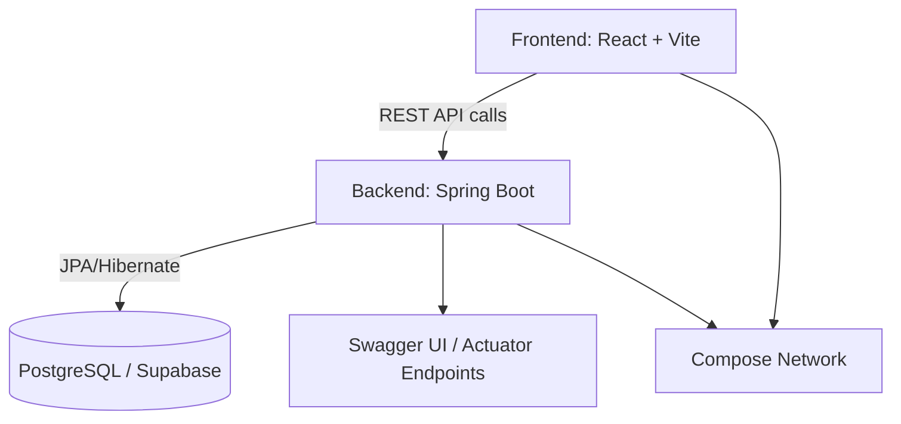

# 🧱 Spring React Vite Template

[](https://github.com/jamesmcdonald112/spring-react-vite-template/actions/workflows/test.yml)
[](./LICENSE)
[](#)

A modern **full-stack starter template** combining **Spring Boot + React + Vite +  + CI/CD**.  
Built for rapid prototyping and real-world deployment, with batteries included:  
✅ type-safe frontend, ✅ production-ready backend, ✅ local +  setup, ✅ GitHub Actions CI.

---

## 🚀 Overview

This template provides a minimal yet complete foundation for modern full-stack apps.  
It’s designed for **developer experience, testability, and maintainability**.

| Layer | Tech Stack | Highlights |
|-------|-------------|------------|
| **Frontend** | React (Vite, TypeScript, TailwindCSS, shadcn/ui) | Hooks-based, fast reload, typed API calls |
| **Backend** | Spring Boot 3 (Java 21, JPA, Actuator, OpenAPI) | RESTful, structured logging, validation |
| **Database** | PostgreSQL ( Compose or Supabase) | Works with local + hosted databases |
| **CI/CD** | GitHub Actions | Build, test, and coverage reporting |
| **Docs** | Swagger / OpenAPI | Auto-generated REST documentation |

---

## 📸 Screenshot or Demo (optional)

You can include a screenshot, animated GIF, or live demo link here.


> 💡 Tip: Store demo images in `/frontend/public` so Vite serves them easily.
> You can also embed a Loom or YouTube video if you have one, for example:
> - Demo video: https://www.loom.com/share/your-demo-id
> - Live preview: https://your-demo-url.example.com

---

## 🧭 Architecture



---

## ✨ Features

### 🖥️ Frontend
- ⚡ **Vite + TypeScript** — lightning-fast dev server with full type safety  
- 🎨 **TailwindCSS + shadcn/ui** — modern, composable UI with accessible components  
- 🧩 **React Query** — automatic caching and background data fetching  
- 🧠 **React Hook Form + Zod** — performant, schema-validated forms  
- 🔔 **Toaster + ErrorBoundary** — built-in global notifications and graceful error handling  
- 🧪 **Vitest + React Testing Library** — fast unit tests with JSDOM  

### ⚙️ Backend
- 🚀 **Spring Boot 3 + Java 21** — modern backend foundation with starter dependencies  
- 🗄️ **Spring Data JPA** — simplifies database access with minimal boilerplate  
- 📄 **Springdoc OpenAPI** — auto-generated Swagger API docs at `/swagger-ui.html`  
- 🩺 **Spring Boot Actuator** — built-in health, metrics, and readiness endpoints  
- 🧱 **Layered architecture** — Controllers → Services → Repositories → Entities → DTOs  
- 🧰 **JUnit + Mockito** — unit & integration tests ready to extend  
- 🧾 **Structured JSON logging** — production-ready logging via Logback + Logstash  

### 🐳 DevOps & Tooling
- 🧩 ** Compose** — runs backend + PostgreSQL seamlessly  
- 🧱 **Multi-stage file** — optimized build for backend JAR  
- ⚙️ **GitHub Actions CI** — build, test, coverage report per PR  
- 🔄 **Dependabot** — weekly dependency updates grouped by type  
- 🪶 **Husky + lint-staged** — auto-format and lint pre-commit  
- 🧪 **JaCoCo Coverage Report** — backend coverage shown in PR summary  
- 🧭 **EditorConfig + VSCode Extensions** — consistent formatting across environments  

---

## 🛠 Prerequisites

- Node.js 22+
- Java 21 (Temurin recommended)
-  & Docker Compose
- Git

---

## ⚙️ Environment Setup

Before running anything, create `.env` files.

**Option 1 — Automatic setup**

```bash
sh setup.sh
```

**Option 2 — Manual setup**

```bash
cp .env.example .env
cp frontend/.env.example frontend/.env
```

> The root `.env` controls backend profiles.  
> Set `SPRING_PROFILES_ACTIVE=dev | supabase | prod`.

---

## 🧱 Backend (Spring Boot)

```bash
cd backend
./gradlew bootRun
```

Access your backend at:

- **API Base URL:** [http://localhost:8080](http://localhost:8080)  
- **Swagger Docs:** [http://localhost:8080/swagger-ui.html](http://localhost:8080/swagger-ui.html)  
- **Health Check:** [http://localhost:8080/actuator/health](http://localhost:8080/actuator/health)

To verify health via terminal:

```bash
curl http://localhost:8080/actuator/health
```

> 💡 **Tip:** Without these `.env` files in place, frontend requests like `/api/ping` may fail or return HTML instead of JSON responses.  
> Always ensure both `backend/.env` and `frontend/.env` exist before running the servers.
---

## 🌍 Backend Profiles

| Profile | Description | Database | Command |
|----------|--------------|-----------|----------|
| `dev` | Local file-based H2 | H2 | `./gradlew bootRun` |
| `supabase` | Hosted Supabase PostgreSQL | Supabase | `docker compose up --build backend` |
| `prod` | Dockerized PostgreSQL | Local Docker container | `docker compose up --build` |

**Health check:**

```bash
curl http://localhost:8080/actuator/health
```

---

## 💻 Frontend (React + Vite)

```bash
cd frontend
npm install
npm run dev
```

App → http://localhost:5173  

---

## 🐳 Docker

**Full Stack (backend + PostgreSQL):**

```bash
 compose up --build
```

**Backend Only (for Supabase mode):**

```bash
 compose up --build backend
```

If you get a port error (`Bind for 0.0.0.0:8080 failed`):

```bash
 ps
 stop <container_id>
 compose down -v
```

---

## 🐳 Docker Tips & Troubleshooting

### 🧩 Backend-Only Mode (for Supabase)
If you’re using Supabase as your database and don’t want to run the local Docker PostgreSQL container, you can start only the backend service:

```bash
docker compose up --build backend
```

This will skip the internal db service and connect directly to your Supabase instance, provided your .env is configured with the correct SUPABASE_* values.

### ⚠️ Common Port Conflict (8080 already in use)

If you see this error:
```bash
Bind for 0.0.0.0:8080 failed
```

It means another container or process is already using port 8080.
Run the following to identify and stop the conflicting container:

```bash
docker ps
docker stop <container_id>
docker compose down -v
```

After that, re-run:

```bash
docker compose up --build
```

### 🧹 Full Reset

If you want a completely clean build (rebuilding all images and removing old volumes):

```bash
docker compose down -v
docker system prune -af
docker compose up --build
```
---

## ⚙️ Environment Variables

### Root `.env.example`

```bash
# =========================
# 🌱 ACTIVE SPRING PROFILE
# =========================
SPRING_PROFILES_ACTIVE=dev

# =========================
# 🧱 LOCAL DEV (H2)
# =========================
# Uses file-based H2 database (no credentials needed)

# =========================
# 🟢 SUPABASE (Cloud DB)
# =========================
# Build your JDBC URL like:
#   jdbc:postgresql://<REGION>-<ref>.pooler.supabase.com:6543/<DATABASE>?sslmode=require
# Found in: Supabase Dashboard → Settings → Database → Connection Info → Transaction Pooler (IPv4)

SUPABASE_JDBC_URL=jdbc:postgresql://aws-1-eu-west-1.pooler.supabase.com:6543/postgres?sslmode=require
SUPABASE_USERNAME=your_supabase_username
SUPABASE_PASSWORD=your_supabase_password

# Optional: silence  warnings if not using Supabase
# SUPABASE_JDBC_URL=""
# SUPABASE_USERNAME=""
# SUPABASE_PASSWORD=""

# =========================
# 🐳 PROD ( PostgreSQL)
# =========================
POSTGRES_USER=admin
POSTGRES_PASSWORD=password
POSTGRES_DB=appdb
```

---

## ⚙️ Environment Variables

Each service has its own `.env.example` for reference.  
The backend `.env` controls which database and profile are active.

---

### 🟢 Supabase Connection Guide

If you’re using Supabase instead of local Postgres, you’ll need to configure three values in your `.env`:

```bash
SUPABASE_JDBC_URL=jdbc:postgresql://<REGION>-<REF>.pooler.supabase.com:6543/<DATABASE>?sslmode=require
SUPABASE_USERNAME=your_supabase_username
SUPABASE_PASSWORD=your_supabase_password
```

### 🔍 Where to find these

In your Supabase Dashboard:
	1.	Dashboard Navbar → Connection Info
	2.	Copy the Transaction Pooler (IPv4) URL
	•	Example: 
    `aws-1-eu-west-1.pooler.supabase.coma`
  3. Build your JDBC URL like this: 
    `jdbc:postgresql://aws-1-eu-west-1.pooler.supabase.com:6543/postgres?sslmode=require`
  4.	Use your Supabase credentials for SUPABASE_USERNAME and SUPABASE_PASSWORD.

> 💡 Always use the ?sslmode=require flag to ensure a secure connection.

### ⚙️ Optional Cleanup

If you’re not using Supabase and want to avoid Docker warnings like:

`The 'SUPABASE_JDBC_URL' variable is not set. Defaulting to a blank string.`

You can safely add these empty lines to your .env:

```
SUPABASE_JDBC_URL=""
SUPABASE_USERNAME=""
SUPABASE_PASSWORD=""
```

  
### Frontend `frontend/.env.example`

```bash
VITE_API_URL=http://localhost:8080/api
```

---

## 🧪 Testing

### Frontend

```bash
cd frontend
npm test
```

### Backend

```bash
cd backend
./gradlew test
./gradlew jacocoTestReport
```

Coverage Report →  
`backend/build/reports/jacoco/test/html/index.html`

---

## 🧰 Continuous Integration (CI)

GitHub Actions run automatically on push and pull requests:

- 🧪 Run frontend & backend tests  
- 📊 Upload coverage  
- ✅ Show coverage summary in PRs  
- 🔁 Dependabot weekly updates  
- 🪶 Lint & format with Husky + lint-staged  

---

## 🧱 Project Structure

```bash
spring-react-vite-template/
├── backend/
│   ├── src/main/java/...
│   ├── src/test/java/...
│   ├── build.gradle
│   └── file.backend
├── frontend/
│   ├── src/
│   ├── vite.config.ts
│   └── package.json
├── .github/workflows/
├── -compose.yml
├── .env.example
├── .editorconfig
├── .vscode/extensions.json
└── README.md
```

---

## ✅ Template Checklist

Before reusing this template for a new project, follow these steps:

1. **Rename your project**
   - Update names in `settings.gradle`, `package.json`, and `README.md`.

2. **Set the active Spring profile**
   - In `.env`, choose one:
     ```bash
     SPRING_PROFILES_ACTIVE=dev     # Local H2 (default)
     SPRING_PROFILES_ACTIVE=supabase  # Hosted Supabase PostgreSQL
     SPRING_PROFILES_ACTIVE=prod    # Dockerized PostgreSQL
     ```

3. **For Supabase users**
   - Fill in your Supabase credentials:
     ```bash
     SUPABASE_JDBC_URL=jdbc:postgresql://<REGION>-<REF>.pooler.supabase.com:6543/<DATABASE>?sslmode=require
     SUPABASE_USERNAME=your_supabase_username
     SUPABASE_PASSWORD=your_supabase_password
     ```
   - Then run only the backend:
     ```bash
     docker compose up --build backend
     ```

4. **For Docker/PostgreSQL users**
   - Use the default database credentials in `.env` or customize:
     ```bash
     POSTGRES_USER=admin
     POSTGRES_PASSWORD=password
     POSTGRES_DB=appdb
     ```
   - Run the full stack:
     ```bash
     docker compose up --build
     ```

5. **For local dev (H2 mode)**
   - Simply run:
     ```bash
     ./gradlew bootRun
     ```

6. **Check backend health**
   ```bash
   curl http://localhost:8080/actuator/health
   ```
7. Update frontend API URL
  - In frontend/.env:
    ```bash
    VITE_API_URL=http://localhost:8080/api
    ```
8. Customise your project
  - Replace sample entities and controllers
  - Adjust UI components, branding, and endpoints as needed

## 📜 License

Licensed under the **MIT License** — see [LICENSE](./LICENSE).

---

**Built with ❤️ using React, Spring Boot, , and GitHub Actions.**
